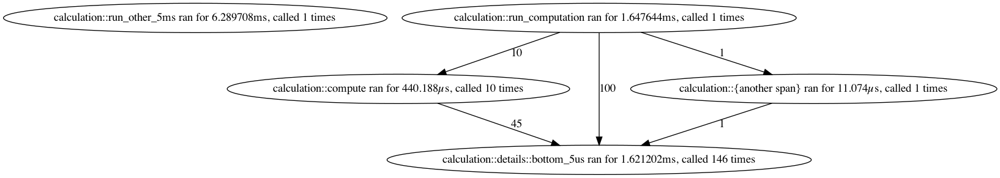

# Time-graph

This crate provides a simple way of extracting the number of time a given
function (or spans inside functions) have been called, how much time have been
spent in each function/span, and record the full "call-graph" between
functions/spans. The indented use case is to extract simple profiling data from
actual runs of a software. Importantly, this crate does not consider different
invocation of the same function/span separately, but instead group all
invocation of functions/span together.

This crate can output timing information in multiple formats, including
graphviz' dot, JSON data and a nice UTF8 table. Here is the output from running
the example with `cargo run --release --example calculation --all-features` (see
the corresponding [code](time-graph/examples/calculation.rs)):

**Graphviz' dot**:


**Terminal table**:

```
╔════╦══════════════════════════════════════════════╦════════════╦═══════════╦══════════╦═════════╗
║ id ║ span name                                    ║ call count ║ called by ║ total    ║ mean    ║
╠════╬══════════════════════════════════════════════╬════════════╬═══════════╬══════════╬═════════╣
║  0 ║ calculation::run_other_5ms                   ║          1 ║         — ║   6.29ms ║  6.29ms ║
╠════╬══════════════════════════════════════════════╬════════════╬═══════════╬══════════╬═════════╣
║  2 ║ calculation::run_computation                 ║          1 ║         — ║   1.65ms ║  1.65ms ║
╠════╬══════════════════════════════════════════════╬════════════╬═══════════╬══════════╬═════════╣
║  1 ║ calculation::compute                         ║         10 ║         2 ║ 440.19µs ║ 44.02µs ║
╠════╬══════════════════════════════════════════════╬════════════╬═══════════╬══════════╬═════════╣
║  4 ║ calculation::{another span}                  ║          1 ║         2 ║  11.07µs ║ 11.07µs ║
╠════╬══════════════════════════════════════════════╬════════════╬═══════════╬══════════╬═════════╣
║  3 ║ calculation::details::bottom_5us             ║        146 ║   2, 4, 1 ║   1.62ms ║ 11.10µs ║
╚════╩══════════════════════════════════════════════╩════════════╩═══════════╩══════════╩═════════╝
```

**JSON**:

```json
{
  "timings": {
    "calculation::run_other_5ms": {
      "id": 0,
      "elapsed": "6.289708ms",
      "called": 1
    },
    "calculation::compute": {
      "id": 1,
      "elapsed": "440.188µs",
      "called": 10
    },
    "calculation::run_computation": {
      "id": 2,
      "elapsed": "1.647644ms",
      "called": 1
    },
    "calculation::details::bottom_5us": {
      "id": 3,
      "elapsed": "1.621202ms",
      "called": 146
    },
    "calculation::{another span}": {
      "id": 4,
      "elapsed": "11.074µs",
      "called": 1
    }
  },
  "calls": [
    { "caller": 1, "callee": 1, "count": 10 },
    { "caller": 3, "callee": 3, "count": 45 },
    { "caller": 3, "callee": 3, "count": 1 },
    { "caller": 4, "callee": 4, "count": 1 },
    { "caller": 3, "callee": 3, "count": 100 }
  ]
}
```

## License and contributions

This crate is distributed under both the [MIT license](LICENSE-MIT) and [Apache
2.0 license](LICENSE-APACHE). By contributing to this crate, you agree to distribute
your contributions under the same license.
